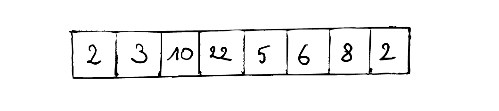
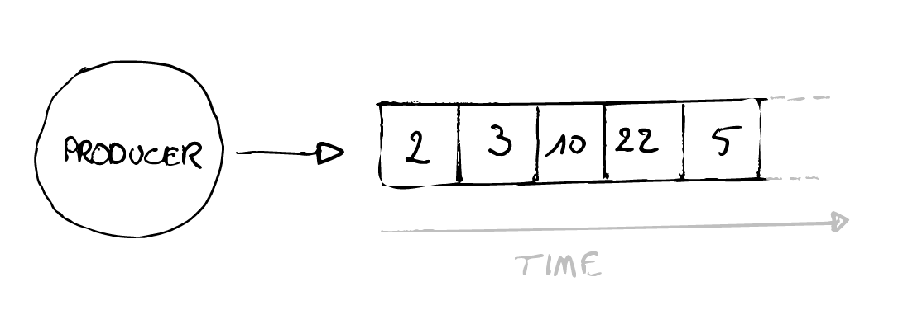
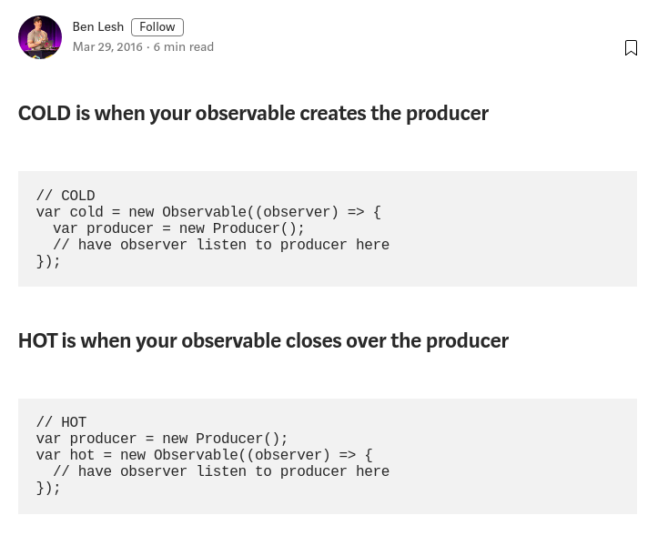

# Core RxJS Concepts

## Array

- data structure that contains elements
- transformable: Map, Reduce, Filter



## Observable

- A stream or source of data over time
- Asynchronous data
- anatomy: next(), error(), complete()



**Examples**

- Time ticker (interval)
- HTTP request
- Button clicks
- Mouse scroll

## Creating observables

**Create observable from a set of values**

```js
import { of } from "rxjs";

const myValues$ = of(1, 2, 3, 4);
```

**Create an observable that outputs an incremental number every timeframe**

```js
import { interval } from "rxjs";

const myIntevarl$ = interval(1000);
```

**Create observable based on an event listener**

```js
import { fromEvent } from "rxjs";

const button = document.getElementById("myButton");
const myObservable$ = fromEvent(button, "click");
```

**Create observable based on a HTTP call**

```js
import { fromFetch } from "rxjs/fetch";

const myObservable$ = fromFetch("https://example.com/movies");
```

By default, these observables won't do anything by theirselves. **This is because Observables are cold or do not activate a producer (like wiring up an event listener), until there is a ...**

## Subscription

**Subscribe to our previously created observable**

```js
const subscription = myObservable$.subscribe(console.log);
```

## Don't forget to unsubscribe!

- always make sure to clean up your subscriptions
- not needed if `complete` or `error`

**Close our subscription to clean up**

```js
const subscription = myObservable$.subscribe(console.log);
subscription.unsubscribe();
```

## Hot & Cold Observables

### Cold Observable

- most observables are cold by default
- unicast
- lazy
- every time

### Hot Observable

- shares underlying subscription
- multicast
- source observable is only susbcribed to once



## Exercises

- [Promise vs Observable](https://codesandbox.io/s/rxjs-fundamentals-exercise-2-promises-observables-8qret) - 15m
- [Start and stop the timer](https://codesandbox.io/s/rxjs-fundamentals-exercise-3-start-stop-timer-97tx6) - 15m
- [Create your own HTTP Observable](https://codesandbox.io/s/rxjs-fundamentals-exercise-5-create-observable-olczg) - 25m

## Live Demo

- [Observables](https://codesandbox.io/s/core-rxjs-concepts-pyic0)
