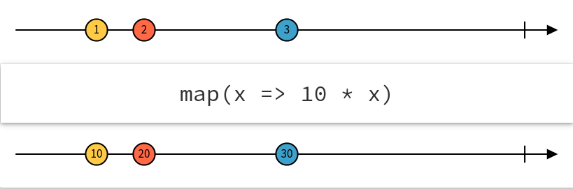
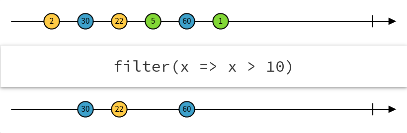

# Operators

## Introducing Operators

- Returns a new observable
- Chainable
- Immutable

```js
import { map } from "rxjs/operators";

const plusOne$ = dataSource$.pipe(
  // add 1 to each emitted value
  map(value => value + 1)
);
```

## Marble diagrams


## Map operator



[Code Example](https://codesandbox.io/s/rxjs-operators-map-example-evsxe)

## Filter operator



[Code Example](https://codesandbox.io/s/rxjs-operators-filter-example-evsxe)

## Flattening

Mapping to inner observables.

[Live Demo](https://codesandbox.io/s/rxjs-fundamentals-flattening-demos-nfxgh)

### concatMap

- Subscribe and emit in order the inner observables arrive
- Does not subscribe to the next Observable until the previous one completes

### mergeMap / flatMap

- Subscribe to each inner observable as they arrive
- Multiple inner subscriptions can be active at one time
- Watch out for memory leaks when using long-lived observables

### switchMap

- Subscribe to inner observable when it arrives, but first cancels previous inner observable if active
- Only one subscription active at a time
- Switch to a new observable

### exhaustMap

- Subscribe to inner observable if previous one is completed, otherwise ignore
- Only one subscription active at a time

## Common Operators

### Combination

- combineLatest ⭐️
- concat
- merge
- startWith ⭐️
- withLatestFrom ⭐️

### Conditional

- iif

### Creation

- from
- of ⭐️
- fromEvent ⭐️
- fromFetch
- interval ⭐️
- timer

### Error handling

- catchError
- retryWhen
- finally

### Multicasting

- shareReplay ⭐️

### Filtering

- debounce / debounceTime ⭐️
- throttle / throttleTime
- distinct
- distinctUntilChanged ⭐️
- filter ⭐️
- take / takeUntil ⭐️
- skip

### Transformation

- map ⭐️
- concatMap ⭐️
- mergeMap / flatMap ⭐️
- switchMap ⭐️
- exhaustMap
- scan ⭐️
- bufferTime

### Utility

- tap
- delay / delayWhen ⭐️

## Exercises

- [XXX: Basic Operators](https://codesandbox.io/s/rxjs-fundamentals-exercise-6-basic-operators-eprth)
- [XXX: Advanced Operators](https://codesandbox.io/s/rxjs-fundamentals-exercise-6-basic-operators-eprth)
- [Create your own re-usable operator](https://codesandbox.io/s/rxjs-fundamentals-exercise-9-reusable-operators-yjjew)
- [XXX: Stop Watch]()
- [Fetch Rick & Morty episode/character lists](https://codesandbox.io/s/rxjs-fundamentals-exercise-8-fetch-episodes-hkegs)
- [XXX: Look Ahead Input]()

## References

- https://rxmarbles.com/
- https://www.learnrxjs.io/learn-rxjs/operators
- https://rxjs-dev.firebaseapp.com/operator-decision-tree
